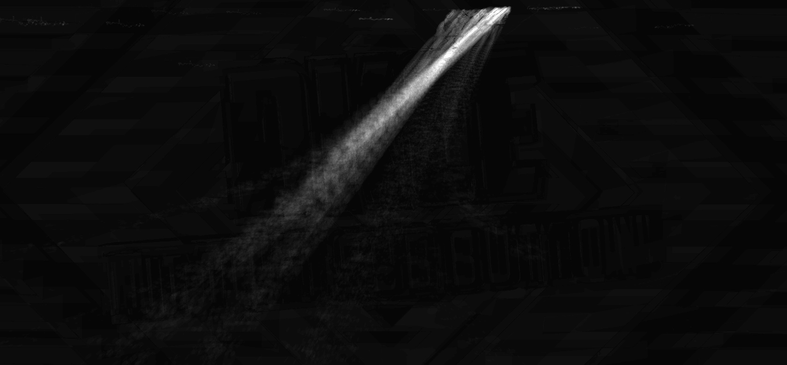

# RatCam :rat::movie_camera:
## Introduction
A simple method for tracking the paths of pesky rodents in my attic, so that the entry points can be blocked!

## Packages
| Name    | Description |
| ------- | ----------- |
| [ratcam-capture:movie_camera:](./capture/) | For acquiring videos of rats from the camera, to be run on the Jetson Nano. |
| [ratcam-process:gear:](./process/) | For analysing these video of rats, to be run on a desktop computer as a post-processing step. |
