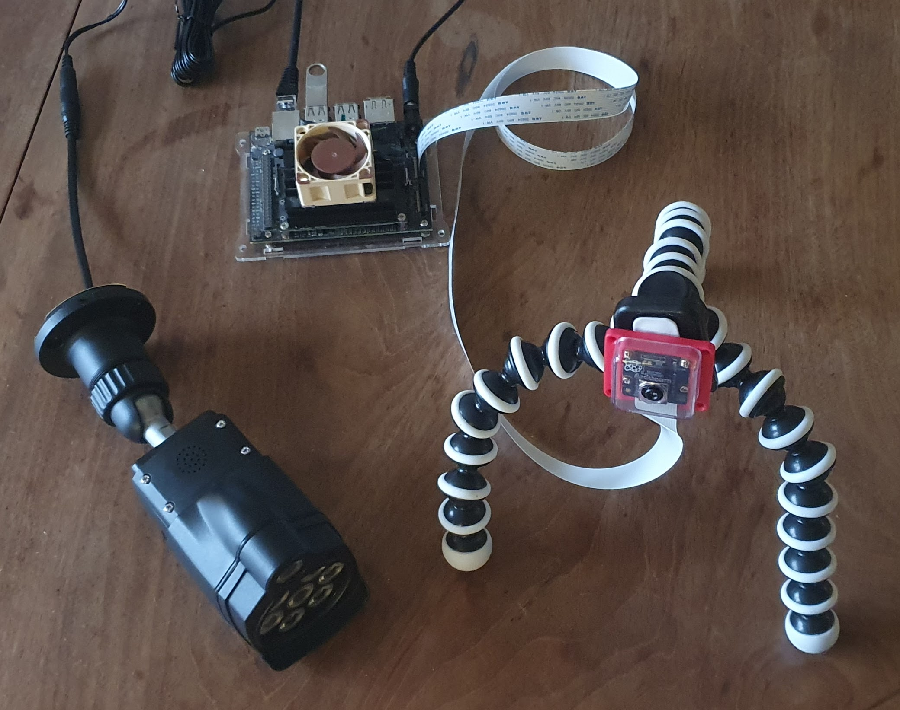

# Capture :movie_camera:
Package for acquiring videos of rats from the camera, to be run on the Jetson Nano. These videos can then be processed later.

## Hardware List
Other hardware configurations will work, but this is the exact configuration setup I used:
- Jetson Nano
- Raspberry Pi NoIR Camera v3 (IMX708)
- IR illuminator
- SD card (64GB)
- USB 3.1 Memory Stick (64GB)
- Gorilla camera stand
- Arducam RPI camera case
- CSI ribbon cable extension



## Prerequisites
1. Connect camera into CAM0 CSI slot on the Jetson. (Ensure the metal connectors on ribbon cable are facing the heatsink).
2. Install latest [JetPack 4.6.4 3](https://developer.nvidia.com/jetpack-sdk-464) (L4T 2.7.4) as per usual.
3. Update and upgrade all apt packages to latest.
4. Ensure ext4 formated USB or storage is connected into the Jetson. Ideally above 64GB to store enough footage.
5. Ensure USB storage is automatically mounted to a location on boot.

    > Tip, add line `UUID=<insert UUID of drive> /media/data auto nosuid,nodev,nofail 0 0` to `/etc/fstab`

## Install Camera Drivers
At the time of writing, the v3 camera (with the Sony X708 sensor) is not supported on the official L4T drivers. The default CSI sensor is IMX219. It is possible to use IMX477 using [Jetson-IO](https://docs.nvidia.com/jetson/archives/l4t-archived/l4t-3273/index.html#page/Tegra%20Linux%20Driver%20Package%20Development%20Guide/hw_setup_jetson_io.html#wwpID0E02D0HA).

Plugging in the CSI connector and rebooting reports `board setup failed` error in dmesg.

For more details on supported sensors, look up [here](https://developer.nvidia.com/embedded/jetson-partner-supported-cameras?t-1_supported-jetson-products=nano).

Fortunately RidgeRun provides the drivers for the IMX708 sensor. Their free driver only supports one sensor mode (4608 x 2592 @ 14fps). To install and use this driver:
1. Access Jetson (Either ssh or plugin monitor, keyboard and mouse)
2. Download the [.deb package](https://drive.google.com/drive/folders/1sjrnHeHoEOkBxllWu4qS8ElnJGoTAWyN) and copy to the Jetson filesystem
2. Install the Debian package to the Jetson:
    ```
    sudo dpkg -i --force-overwrite ./nano.deb
    ```
3. Enable the device tree changes, by editing `/boot/extlinux/extlinux.conf` file and set contents to:
    ```
    TIMEOUT 30
    DEFAULT Develop

    MENU TITLE L4T boot options

    LABEL primary
        MENU LABEL primary kernel
        LINUX /boot/Image
        FDT /boot/dtb/kernel_tegra210-p3448-0003-p3542-0000.dtb
        INITRD /boot/initrd
        APPEND ${cbootargs} quiet root=/dev/mmcblk0p1 rw rootwait rootfstype=ext4 console=ttyS0,115200n8 console=tty0 fbcon=map:0 net.ifnames=0 nv-auto-config
    ```
4. Reboot the Jetson:
    ```
    sudo reboot
    ```
5. Verify drivers work by capturing image:
    ```
    gst-launch-1.0 nvarguscamerasrc num-buffers=1 sensor_id=0 ! 'video/x-raw(memory:NVMM), width=4608, height=2592, framerate=14/1, format=NV12' ! nvjpegenc ! filesink location=test_image.jpg
    ```

For more details, follow the instructions on [ridgerun.com](https://developer.ridgerun.com/wiki/index.php/Raspberry_Pi_Camera_Module_3_IMX708_Linux_driver_for_Jetson#Installing_the_Driver_-_Option_A:_Debian_Packages_(Recommended))

## Install Package
Install the poetry package for the capture program:

1. Clone the repo:
    ```
    mkdir -p ~/github
    cd ~/github
    clone git@github.com:magnusmaynard/ratcam.git
    ```
2. Most packages are installed via JetPack, however there are some additional dependencies required:
    ```
    sudo apt install libcairo2-dev libgirepository1.0-dev
    ```
3. Install and build poetry package:
    ```
    mkdir -p ~/github

    cd ~/github/ratcam/capture
    poetry install
    poetry build
    pip3 install --editable .
    ```

## Install Service
Start video capture automatically on boot of the Jetson Nano:

1. Create symlink to service in repo:
    ```
    sudo ln -s ~/github/ratcam/capture/service/ratcam-capture.service /etc/systemd/system/.
    ```
2. Manually start service:
    ```
    sudo systemctl start ratcam-capture.service
    ```
3. Check service is running:
    ```
    systemctl status ratcam-capture.service
    ```

## Manual Run
Sometimes it is useful to manually run the capture program, for example to debug issues:

1. Ensure service is not running:
    ```
    sudo systemctl stop ratcam-capture.service
    ```
2. Manually begin capture:
    ```
    ratcam-capture -o /media/data
    ```
