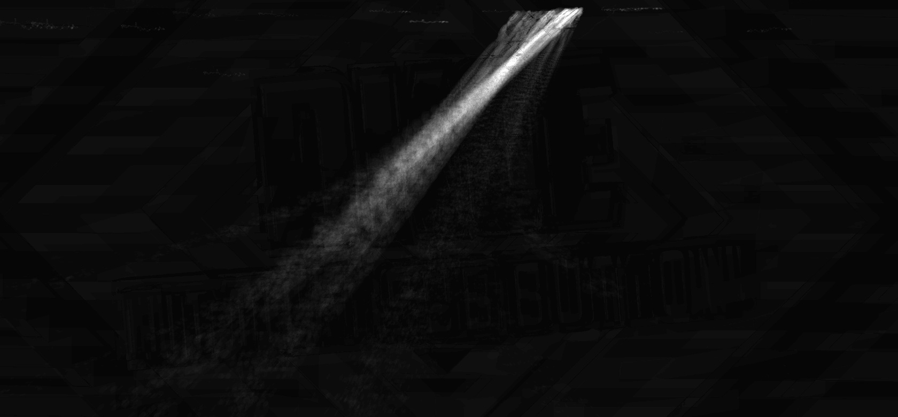

# Process :gear:
Package for analysing videos of rats, to be run on a desktop computer as a post-processing step. Processing could be done on the Jetson Nano, but it is recommended to run on separate desktop machine for performance.

This performs simple frame differencing as the post processing step, using OpenCV's [BackgroundSubtractorMOG](https://docs.opencv.org/3.4/d6/da7/classcv_1_1bgsegm_1_1BackgroundSubtractorMOG.html), visualising the paths of the rats. Real-time motion or object detection could have been used instead, however this approach is sufficient for now. This implementation was loosely based on [this example](
https://github.com/robertosannazzaro/motion-heatmap-opencv/blob/master/motion_heatmap.py).

The output produced is a heatmap image, showing the paths of motion. This is an example processing output of some videos of traffic (not rats):



## Install
Install the poetry package for the capture program:

1. Clone the repo:
    ```
    mkdir -p ~/github
    cd ~/github
    clone git@github.com:magnusmaynard/ratcam.git
    ```
2. Install and build poetry package:
    ```
    mkdir -p ~/github

    cd ~/github/ratcam/process
    poetry install
    poetry build
    pip3 install --editable .
    ```

## Run
To process a directory containing captured videos:

1. Copy videos to local machine, or plug in USB drive from Jetson.
2. Run the program:
    ```
    ratcam-process -d /path/to/videos
    ```

> Hint: To speed up processing, skip frames by setting the interval argument. This may also require increasing the sensitivity as less frames are being processed.
